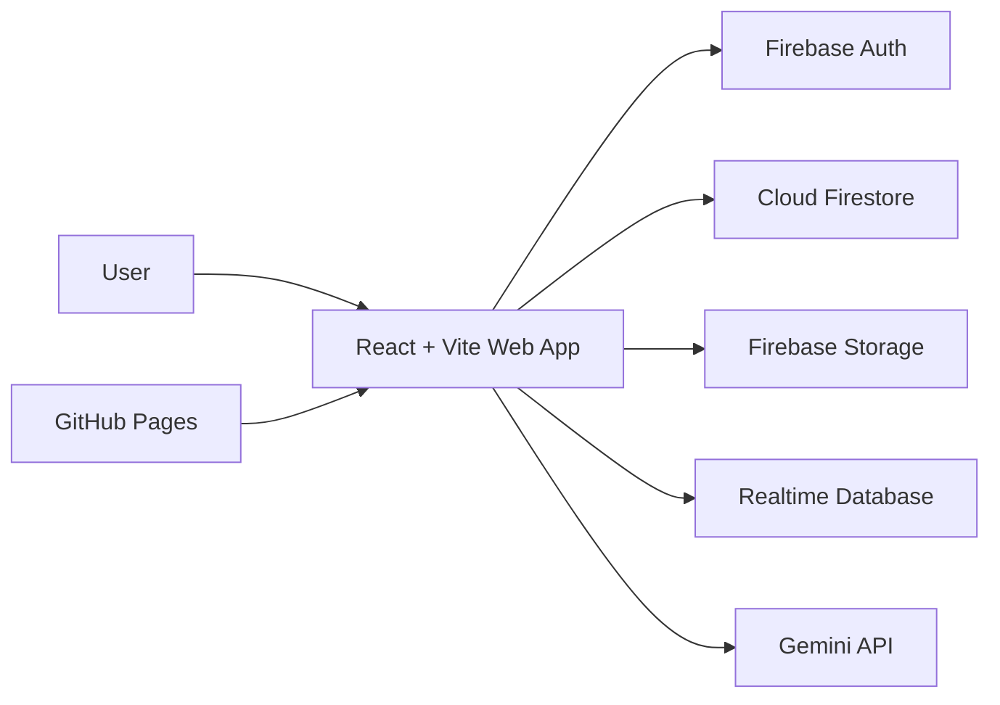

# Farmer.Company


Farmer.Company is an India-first agricultural commerce and market intelligence platform for farmers, aggregators, vendors, logistics partners, researchers, institutions, and operations teams.

The application combines commodity discovery, price visibility, assisted trade intent capture, supply CRM, logistics coordination, role-aware onboarding, and AI-supported market insight surfaces into one beta product.

- Production domain: [farmer.company](https://farmer.company)
- Product stage: Beta
- Application type: Static React/Vite web app
- Hosting: GitHub Pages
- Backend services: Firebase Auth, Firestore, Storage, Realtime Database, and App Check

## Table of Contents

- [Product Overview](#product-overview)
- [User Segments](#user-segments)
- [Core Capabilities](#core-capabilities)
- [Application Routes](#application-routes)
- [Architecture](#architecture)
- [Technology Stack](#technology-stack)
- [Repository Structure](#repository-structure)
- [Prerequisites](#prerequisites)
- [Getting Started](#getting-started)
- [Environment Configuration](#environment-configuration)
- [Firebase Configuration](#firebase-configuration)
- [Data Model](#data-model)
- [Scripts](#scripts)
- [Testing and Quality](#testing-and-quality)
- [Deployment](#deployment)
- [Product Documentation](#product-documentation)
- [Development Standards](#development-standards)
- [Security and Privacy](#security-and-privacy)
- [Troubleshooting](#troubleshooting)
- [Roadmap](#roadmap)
- [Contributing](#contributing)
- [License](#license)

## Product Overview

Farmer.Company is built to support trusted national agricultural trading and market discovery. The beta focuses on practical workflows: helping sellers create supply intent, helping buyers discover verified supply, helping operations teams track follow-up, and helping analysts understand market signals with clear source and freshness context.

The product is not only a showcase site. It is a working beta surface for:

- Commodity and market discovery
- Price and arrival signal exploration
- Buy and sell intent submission
- Phone-based onboarding and verification
- Supply CRM and operational lead follow-up
- Segment-specific pages for farmers, vendors, logistics partners, customers, researchers, and AI agents
- Product strategy and delivery documentation for beta execution

## User Segments

| Segment | Primary Need |
| --- | --- |
| Farmers and local sellers | Understand fair price ranges, find serious buyers, and submit sell intent with minimal friction. |
| Aggregators and vendors | Track structured demand, supply, and follow-up across commodities and regions. |
| Traders and institutional buyers | Discover credible supply faster and compare market opportunities. |
| Logistics partners | Coordinate agricultural movement and logistics readiness. |
| Researchers and analysts | Review market signals, price movement, and regional intelligence. |
| Operations teams | Validate leads, manage next actions, and support assisted trade workflows. |

## Core Capabilities

- Role-aware beta onboarding
- Firebase phone OTP authentication
- Location capture with DIGIPIN support
- Market and commodity browsing
- Price discovery and arrival signal surfaces
- Buy and sell trade intent capture
- Firestore write path with local fallback for trade intents
- Supply CRM workflow pages
- AI-assisted insight areas powered by Gemini configuration
- Multilingual-ready app shell
- Static deployment through GitHub Pages

## Application Routes

The app uses `HashRouter`, so deployed URLs may appear as `/#/market` even though the internal route is `/market`.

| Route | Purpose |
| --- | --- |
| `/` | Homepage and product overview |
| `/story` | Company story |
| `/market` | Market discovery |
| `/prices` | Commodity price exploration |
| `/insights` | Market insight surface |
| `/configure` | Configuration workflow |
| `/supply-crm` | Supply CRM workflow |
| `/farmers` | Farmer-facing segment page |
| `/vendors` | Vendor and buyer segment page |
| `/logistics` | Logistics segment page |
| `/customers` | Customer and buyer page |
| `/researchers` | Research and analyst page |
| `/agents` | AI agent page |
| `/demo` | Demo page |
| `/signin` | Phone authentication flow |
| `/get-started` | Beta onboarding flow |

## Architecture



### Runtime Flow

1. GitHub Pages serves the static Vite build.
2. React Router handles navigation through hash-based routes.
3. Firebase initializes from `firebase-applet-config.json`.
4. Firebase App Check protects configured Firebase requests.
5. Authenticated and unauthenticated user flows write structured data to Firestore where allowed by rules.
6. Trade intent submission falls back to local storage when Firestore writes fail.
7. Gemini-backed features use `GEMINI_API_KEY` loaded by Vite configuration.

## Technology Stack

| Area | Technology |
| --- | --- |
| UI framework | React 19 |
| Language | TypeScript |
| Build tool | Vite 6 |
| Styling | Tailwind CSS v4 |
| Routing | React Router DOM v7 |
| Backend services | Firebase JS SDK |
| Authentication | Firebase Auth phone OTP |
| Database | Cloud Firestore |
| Storage | Firebase Storage |
| Realtime data | Firebase Realtime Database |
| App protection | Firebase App Check |
| AI | Google GenAI SDK |
| Charts | Recharts |
| Animation | Motion, GSAP |
| Icons | Lucide React |
| Tests | Vitest, Testing Library, jsdom |
| Quality | ESLint, TypeScript |
| Hosting | GitHub Pages |

## Repository Structure

```text
.
|-- .github/
|   `-- workflows/
|       `-- static.yml            # GitHub Pages deployment workflow
|-- artifacts/                    # Generated screenshots and verification artifacts
|-- components/
|   `-- ui/                       # Shared UI primitives
|-- Product_Docs/                 # PRD, UX, delivery plan, backlog, and working docs
|-- public/
|   |-- CNAME                     # Production custom domain
|   |-- favicon.png
|   `-- agrios_dashboard_mockup.png
|-- src/
|   |-- App.tsx                   # Providers and route map
|   |-- main.tsx                  # React entrypoint
|   |-- index.css                 # Global CSS and Tailwind layer
|   |-- components/
|   |   |-- Home/                 # Homepage sections
|   |   `-- Pages/                # Route-level product pages
|   |-- data/                     # Commodity and market datasets
|   |-- lib/                      # Firebase, auth, language, market, and domain helpers
|   `-- pages/                    # Shared app pages such as 404
|-- .env.example                  # Local environment template
|-- components.json               # UI component configuration
|-- design.md                     # Design system reference
|-- firebase-applet-config.json   # Firebase web app config
|-- firestore.rules               # Firestore security rules
|-- package.json                  # Scripts and dependencies
|-- tsconfig.json                 # TypeScript configuration
`-- vite.config.ts                # Vite, aliases, env, Tailwind, and test config
```

## Prerequisites

- Node.js 20 recommended
- npm 10 or newer recommended
- Firebase project with web app configuration
- Firebase Authentication with phone provider enabled
- Firestore database configured with the expected database ID
- Firebase App Check configured for local and production environments
- Gemini API key for AI-powered features

## Getting Started

Clone the repository and install dependencies:

```bash
npm install
```

Create a local environment file.

PowerShell:

```powershell
Copy-Item .env.example .env.local
```

macOS or Linux:

```bash
cp .env.example .env.local
```

Start the development server:

```bash
npm run dev
```

Open the local app:

```text
http://localhost:3000
```

## Environment Configuration

Set local-only values in `.env.local`. Do not commit `.env.local`.

| Variable | Required | Example | Purpose |
| --- | --- | --- | --- |
| `GEMINI_API_KEY` | Yes | `your_gemini_api_key` | Enables Gemini-backed AI features. |
| `APP_URL` | Recommended | `http://localhost:3000` | Canonical local or hosted app URL. |
| `VITE_FIREBASE_APPCHECK_DEBUG_TOKEN` | Local only | `debug-token` | Optional local Firebase App Check debug token. |

The Vite config maps `GEMINI_API_KEY` into the client build through `process.env.GEMINI_API_KEY`. Restart the dev server after changing environment variables.

## Firebase Configuration

Firebase initializes in `src/lib/firebase.ts` from `firebase-applet-config.json`.

Configured exports:

- `auth`: Firebase Authentication
- `db`: Cloud Firestore
- `storage`: Firebase Storage
- `rtdb`: Firebase Realtime Database

Important Firebase files:

| File | Purpose |
| --- | --- |
| `firebase-applet-config.json` | Firebase web app config and Firestore database ID. |
| `src/lib/firebase.ts` | Firebase SDK initialization and App Check setup. |
| `src/lib/AuthContext.tsx` | Auth state and profile loading. |
| `src/components/AuthFlow.tsx` | Phone OTP, beta role, profile, location, and registration flow. |
| `src/lib/tradeIntents.ts` | Trade intent Firestore write with local fallback. |
| `firestore.rules` | Firestore authorization rules. |

Firebase web API keys are not secret by themselves, but production Firebase projects must still enforce domain restrictions, App Check, security rules, and least-privilege access.

## Data Model

The current rules and code reference these primary Firestore collections:

| Collection | Purpose |
| --- | --- |
| `users` | App user profiles, roles, verification state, and preferences. |
| `beta_registrations` | Beta onboarding records submitted during authentication. |
| `trade_intents` | Buy and sell requirements submitted from market or price flows. |
| `commodity_interests` | Commodity interest records. |
| `farmers` | Farmer profile data. |
| `skus` | Commodity SKU definitions. |
| `production_records` | Farmer production and harvest records. |
| `listings` | Sell-side commodity listings. |
| `orders` | Buyer-seller order workflow records. |
| `forecasts` | Market or commodity forecast records. |
| `messages` | Communication records. |

TypeScript domain interfaces live in `src/lib/os-types.ts`.

## Scripts

| Command | Description |
| --- | --- |
| `npm run dev` | Starts Vite on port `3000` and host `0.0.0.0`. |
| `npm run build` | Builds the production app into `dist/`. |
| `npm run preview` | Builds and serves the production bundle locally. |
| `npm run lint` | Runs ESLint and `tsc --noEmit`. |
| `npm run test` | Runs the Vitest test suite. |
| `npm run clean` | Removes `dist/`. |

## Testing and Quality

Run the full local quality gate before merging or deploying:

```bash
npm run lint
npm run test
npm run build
```

For UI changes, manually verify:

- Homepage layout and navigation
- Market and prices workflows
- Sign-in and beta onboarding
- Supply CRM
- Segment pages
- Mobile widths for farmer and field-user flows
- Desktop widths for trade desk and intelligence flows

## Deployment

Deployment is handled by GitHub Actions in `.github/workflows/static.yml`.

Deployment flow:

1. Push to `main`.
2. GitHub Actions checks out the repository.
3. Node 20 is installed.
4. Dependencies are installed with `npm ci`.
5. The app builds with `npm run build`.
6. `dist/index.html` is copied to `dist/404.html` for static fallback support.
7. The `dist/` artifact is deployed to GitHub Pages.

The production custom domain is configured through `public/CNAME`.

## Product Documentation

Product documentation starts at `Product_Docs/README.md`.

Recommended reading order:

1. `Product_Docs/PRD/PRD_Beta_v1.md`
2. `Product_Docs/UI_UX/UI_UX_Strategy.md`
3. `Product_Docs/UI_UX/Screen_Requirements.md`
4. `Product_Docs/In_Progress/Beta_Delivery_Plan.md`
5. `Product_Docs/In_Progress/PRD_File_Checklist.md`
6. `Product_Docs/To_Develop/Improvements.md`
7. `Product_Docs/To_Develop/Bug_Fixes.md`
8. `Product_Docs/To_Develop/Suggestions.md`

## Development Standards

### Product Principles

- Trust over flash: prices, signals, and claims need source and freshness context.
- India-first realism: mobile constraints, language diversity, assisted workflows, and uneven connectivity matter.
- Progressive complexity: simple farmer flows first, deeper trade and intelligence tools where needed.
- Human-in-the-loop: beta workflows may rely on assisted operations until automation is reliable.

### UX Modes

| Mode | Audience | Design Direction |
| --- | --- | --- |
| Field Mode | Farmers, village sellers, assisted agents | Large actions, minimal steps, readable copy, callback-friendly flows. |
| Trade Desk Mode | Traders, wholesalers, procurement users | Fast scanning, filters, comparisons, RFQ and follow-up visibility. |
| Intelligence Mode | Analysts, institutions, asset managers | Source transparency, confidence indicators, export-ready summaries. |

### Engineering Guidelines

- Prefer existing components, route patterns, and helper modules before adding new abstractions.
- Keep Firebase writes resilient and preserve fallback behavior for critical user submissions.
- Keep transaction-heavy copy clear and literal.
- Clearly label beta, indicative, delayed, or unverified data.
- Avoid committing generated build output unless explicitly required.
- Keep secrets, private credentials, service account keys, and real debug tokens out of git.

## Security and Privacy

This app handles sensitive user data, including phone numbers, roles, location-derived data, and trade intent details. Treat all user-submitted data as private unless a product requirement explicitly says otherwise.

Security checklist:

- Review `firestore.rules` before shipping data model changes.
- Keep Firebase App Check enabled for production.
- Restrict Firebase Auth authorized domains.
- Restrict API keys where supported by the provider.
- Do not commit `.env.local` or service account credentials.
- Use least-privilege access for Firebase console users.
- Validate form data before writing to Firestore.
- Avoid logging phone numbers, location data, or sensitive trade details in production.

## Troubleshooting

### Development Server

- Confirm Node.js and npm are installed.
- Confirm port `3000` is available.
- Delete `node_modules` and reinstall dependencies if packages are corrupted.

### Firebase Auth

- Confirm phone authentication is enabled in Firebase.
- Confirm the local domain is authorized in Firebase Auth settings.
- Confirm reCAPTCHA and App Check settings are valid for the environment.

### Firestore Writes

- Check browser console errors from `handleFirestoreError`.
- Confirm the authenticated user has the expected role.
- Review `firestore.rules` for collection-level permissions.
- Confirm the configured Firestore database ID matches `firebase-applet-config.json`.

### AI Features

- Confirm `GEMINI_API_KEY` exists in `.env.local`.
- Restart Vite after changing environment variables.
- Check provider quota, billing, and request errors.

### Deployment

- Check the GitHub Actions run for install, build, artifact upload, and Pages deploy errors.
- Confirm GitHub Pages is enabled for the repository.
- Confirm `public/CNAME` contains `farmer.company`.

## Roadmap

The beta delivery plan currently prioritizes:

- Trust-ready price data with source and freshness metadata
- Real buy and sell intent workflows
- Operations queue and lead status tracking
- Mobile-first farmer and field-user flows
- Structured dashboard posture for enterprise and trade users
- Authentication and persistence hardening
- Loading, empty, retry, and error states
- Beta QA and pilot onboarding

## Contributing

This is a private beta product repository. Contributors should follow this workflow:

1. Read the relevant product docs before changing user-facing behavior.
2. Create a focused branch for the change.
3. Keep changes scoped to the requested feature, fix, or documentation update.
4. Run `npm run lint`, `npm run test`, and `npm run build`.
5. Include screenshots or notes for UI changes.
6. Document Firebase rule or data model changes in the pull request.
7. Request review from product and engineering owners for workflow changes.

## License

This repository currently does not include a dedicated license file. Add one before distributing, sublicensing, or accepting external contributions.
